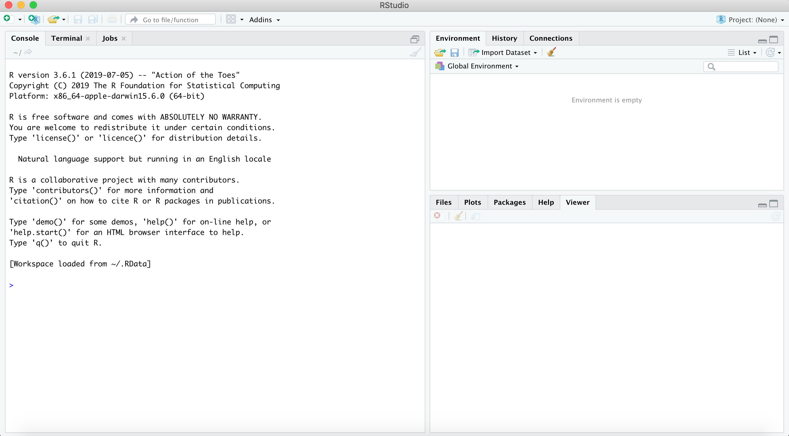
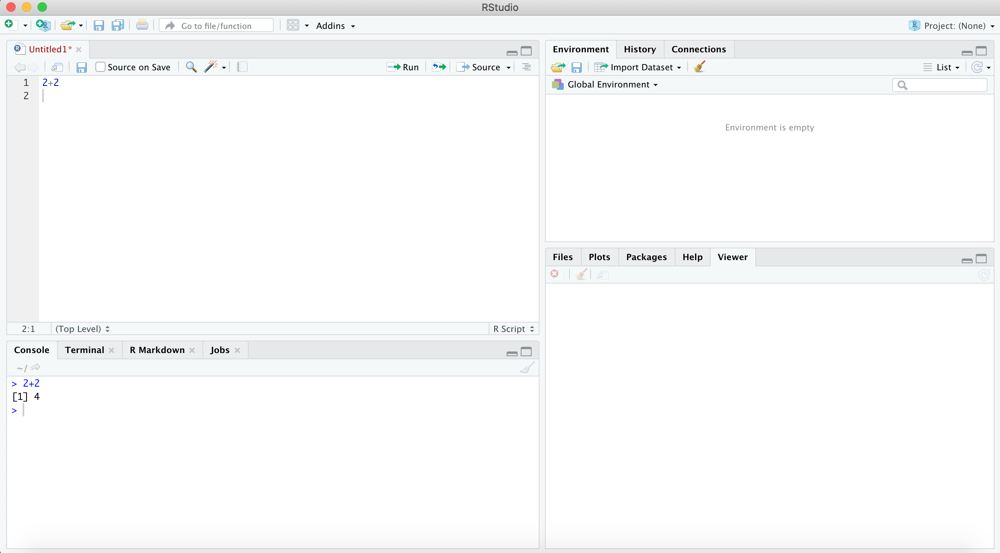

```{r setup, include=FALSE}
knitr::opts_chunk$set(echo = TRUE)
```
## What is R? 
R is a programming language and software that is often used to do statistical analyses. For the purposes of this course, you can think of R as an “upgraded calculator” that allows you to analyze data using the methods you are learning in this course. 

## Why R? 
There are many other programs that allow you to analyze data in similar ways. You may have heard of Stata or Matlab, just to name a few. While for the purposes of this course any of these languages would work just fine, we have decided to use R because it is freely available to anyone in the world. Thus, even after having taken this course, you can continue improving your coding skills using R. There are also some technical advantages to using R in that it is more flexible than Stata and has more statistical libraries than for example Matlab. 

## Downloading R and RStudio
When working with R it is best to work with RStudio. Officially, RStudio is an integrated development environment for R. More intuitively, you can think of RStudio as a program that allows you to interact with R more easily. In practice this means we will only work with RStudio. However, note that in order for RStudio to work you need to have R installed on your computer as well. Hence, you need to download both. 

_Mac Users_

You can download R by following these six steps. (i) Click on <https://www.r-project.org>, (ii) click on “download R” in the “Getting Started” section, (iii) select a CRAN location (a mirror site) (i.e. choose your country) and click on the corresponding link, (iv) click on the “Download R for (Mac) OS X” link at the top of the page, (v) click on the file containing the latest version of R (the .pkg file under “Latest Release”), and (vi) follow the installation instructions. 

You can download RStudio by following these four steps. (i) Click on <https://rstudio.com>, (ii) click on “Download” at the top of the page, (iii) download the free version of RStudio Desktop, and (iv) click on the version recommended for your system, or the latest Mac version (i.e. the .dmg file in the “All Installers” section). After downloading this file, make sure to drag and drop RStudio into your Applications folder. 

_Windows Users_

You can download R by following these six steps. (i) Click on <https://www.r-project.org>, (ii) click on “download R” in the “Getting Started” section, (iii) select a CRAN location (a mirror site) (i.e. choose your country) and click on the corresponding link, (iv) click on the “Download R for Windows” link at the top of the page, (v) click on “install R for the first time,” (vi) click on “Download R for Windows” and save the executable file somewhere on your computer. Run the .exe file and follow the installation instructions. 

You can download RStudio by following these four steps. (i) Click on <https://rstudio.com>, (ii) click on “Download” at the top of the page, (iii) download the free version of RStudio Desktop, and (iv) click on the version recommended for your system, or the latest Windows version (i.e. the .exe file in the “All Installers” section). 

## Opening the RStudio Environment

Once you open RStudio, you should see something like this 


 
As you can see, there are three sections. Ignore the right-hand side for now and focus on the console on the left side. That console is R. This means that you could write a command into the console and R would run this command. As a simple example, we could try to ask R to calculate two plus two for us, i.e. type
```{r eval=FALSE}
2+2
```
and execute the code (press "Enter"). You should see the following output
```{r echo=FALSE}
2+2
```

An issue with what we just did is that we cannot save this code. For hopefully obvious reasons, it is very useful to be able to save your code. In RStudio we can do this by writing a script. To open a script, click on "File," "New File," and then "R Script." Any code you write should be written into this script. As an exercise, try to rerun the code from above again. If you want to execute your whole script, you can click on "Run" at the top of the script. If you just want to run a specific line in a script, you can highlight that line and then again click "Run." Alternatively, you can press "Ctrl+Enter" right after typing your code. Either way, you will see the result pop up in your console. Note that you can save a script by clicking "File" and then "Save as..." as you would in a Word document. Figure 2 below shows RStudio after having typed the code above. 



Now let's focus on the right-hand side of RStudio. At the top you can see your environment. You can think of this as a place to store your dataset, your results, or pretty much anything else you can think of. We will learn how to import datasets later on. For now, suppose we want to assign a specific value to a specific letter and save it. We could do this as follows
```{r eval=FALSE}
x<-2
```

Once you execute this code, you should see that you assigned the value 2 to the letter x in your environment. 

The last quadrant in the lower half of the right side is a place where you can, amongst other things, display figures that you plot. We will learn more about this part as we go along. 

## Getting Started

_Clearing the Workspace._ Suppose you open RStudio one morning and when you open it you see old datasets and variables from a previous R session in your environment. It might be good to get rid of all of this before starting your new R session. You can do this by writing this command 
```{r eval=FALSE}
rm(list=ls())
```
It is good practice to keep this line of code at the top of every R script so that you always start working with a clean environment. 

_Installing Packages._ When working in R, we will use functions that other people have written. For example, for running an OLS regression, we will use a function called "lm" (more on this below). In order to be able to use these functions, we need to tell R to install the function. You only have to install a function once. R will then (forever) remember that you have installed this function. However, once installed, you need to tell R that you will use this function everytime you work in R. We do this by loading the function. Again, every time you open R you will have to load all the functions you will use at the top of your script. You only have to install functions once. Functions are hidden within packages in R. So in order to install and load a function, you'll have to install and load a package. If you were to install and load the package "foreign" (don't worry about what it does yet), you could type (note that R is case sensitive)
```{r eval=FALSE}
install.packages("foreign")
library(foreign) # the function require() also works
```

_Comments in R._ Notice that after loading the package with the "library" command above, there is a hashtag followed by a comment. R considers anything behind a hashtag as a comment and does not look at it as code. Note that it is good practice to always comment what your code does. 

_Setting your Working Directory._ Suppose you have saved a dataset somewhere on your computer and want to load it into R. Alternatively, suppose that you have made a figure in R and want to save it on your computer. Instead of always writing down the exact path to the folder where you want to save output or where you want to import files from, it is useful to tell R at the beginning of each session what folder you will work from. We call this setting your working directory. 
```{r eval=FALSE}
setwd("[ENTER YOUR PATH]")
```
You should always do this at the beginning of each R session. As an example, for a Mac user, the path may look something like this
```{r eval=FALSE}
setwd("/Users/johndoe/Dropbox/EC2020/Activity1/R Application")
```

_Help._ What can you do if you don't understand what a specific function does? Luckily, R has a help function built in. Suppose you don't understand what the "library" function does that we used to load a package above. You could type 
```{r eval=FALSE}
?library
```
to find out. You will see the help file pop up in the lower half of the right side of RStudio. 

Another great place to go when facing problems is Google. Most questions and issues you will encounter when trying to code will have been encountered by other people before. Hence, when you get stuck, or don't understand what a specific code does, Google usually provides an answer. 

## Basic Operations 

Let us now focus on some basic operations. Specifically, consider the following code
```{r eval=FALSE}
example_scalar <-  5  
example_vector <-  c(6,7,8,9,10)
example_matrix <- matrix(rep(0,9), nrow=3, ncol=3) # rep(0,9) = replicate 0 9 times
example_dataframe <- data.frame(example_vector, 2*example_vector, -2+5*example_vector)
example_list <- list(example_dataframe, example_vector, "your favourite professor", 5)
```

The first line just defines a scalar, namely 5. Hence, if later on in your code you were to add 3 and "example_scalar" you should get 8. The second line defines a (1 x 5) row vector consisting of numbers 6 through 10. The third line defines a matrix with 3 rows ("nrow=3") and 3 columns ("ncol=3"). The first argument defines the nine numbers that will go into this matrix, in our case just a bunch of zeros. The fourth and fifth lines of code create a dataframe and a list. Dataframes and lists are more flexible data types, and can hold multiple different column types. Note that lists are the most flexible but they also use the most memory. Hence, as soon as possible you should use the "unlist()" function to remove the list. 

Next, we will focus on subsetting and extraction. Suppose that you are only interested in the second, third, and fourth argument of the vector we just defined above. You could create a new vector with only these elements by running the first line of code below. You can go through the other lines of code yourself to see what they do. 
```{r eval=FALSE}
subsetted_example_vector <- example_vector[2:4]
extracted_from_example_vector <- example_vector[2]
example_vector_with_bit_deleted <- example_vector[-4]
extracted_from_example_list <- example_list[[2]]
extracted_and_subsetted_from_example_list <- example_list[[2]][1]
subvector_of_example_matrix <- example_matrix[,1]
```

Lastly, consider some basic transformations of the vector we defined above. The first line of code below demeans the vector, the second squares it. 
```{r eval=FALSE}
demeaned_example_vector <- example_vector - mean(example_vector, na.rm=TRUE) 
# na.rm=TRUE means remove missing values
example_vector_elementwise_squared <- example_vector^2
```

## Loading Data

For the purposes of this course, we will mostly work with datasets that you can either find online or that will be provided to you. Loading these files into R (once you have set your working directory to where these files are saved on your computer) is straightforward. For example, suppose you have a .csv file saved on your computer called example1.csv. You could load this file into R as follows
```{r eval=FALSE}
ex_data1 <-read.csv("example1.csv") # loading example csv file
```
In case you have an excel file, you could load it with the following command
```{r eval=FALSE}
ex_data2 <-read.xlsx("example2.xls") # loading example excel file (also for xlsx extensions)
```
Lastly, in case you have a Stata file (.dta format), you can load it as follows (you need to have the "foreign" package installed for this)
```{r eval=FALSE}
ex_data3 <-read.dta("example3.dta") # loading example stata file
```
Just to be clear. The three commands above won't work in case you try them since these datasets don't actually exist. This was just to give you the required commands to load datasets in the future. 

To make things concrete, let's load a .csv file into R. Specifically, consider the file "lalondeexp.csv" uploaded online. We can read it by running the following command
```{r eval=FALSE}
data <-read.csv("lalondeexp.csv") # loading real data
```
You should now see this data in your environment. It contains 445 observations and 13 variables. Let us explore this data a bit. For example, we may want to look at the dataset (as you would, for example, at an excel sheet with data). To do this, you can type
```{r eval=FALSE}
View(data) # look at data
```
Alternatively, you may just want to look at the first five rows of the data
```{r eval=FALSE}
head(data) # only display first few rows
```
Lastly, we may want to summarize the data. Conveniently, R provides a simple command that allows you to see the some basic summary statistics (mean, median, first and third quartiles, min, and max). Type 
```{r eval=FALSE}
summary(data) # summarize data
```

## Running an OLS Regression

We will now use the above dataset to try to run our first OLS regression. To provide some context, the data we loaded into R is from a job training program that was given to workers over a 9 to 18 months period in the 1970s. The program randomly assigned some applicants to the program. 

To be clear, in your data, each row displays corresponds to a person (identified in the data by the "id" variable). For each person, the data therefore gives us their age, education etc. For now, we are only interested in two variables: "re78" and "treat." The first here tells us the individual's earnings after the program and "treat" tells us whether the individual was part of the program or not. Our aim is now to run an OLS regression to inquire whether the treatment affected worker earnings, i.e. for each worker i 
$$ re78_i = \beta_0 + \beta_1 treat_i + \epsilon_i $$
We can do this by using the "lm" command
```{r eval=FALSE}
OLS <- lm(re78 ~ treat, data=data) # run OLS regression
```
The function "lm" as we use it here has two arguments. The first is the formula, which in our case consists of telling R to regress re78 on treat. Note that R automatically includes an intercept. The second argument is that we need to tell R what data to use. In our case, this data is called data. See "?lm" for more details. 

You should see the object "OLS" in your environment. This object contains the results from your regression. To see a summary of your results you can type 
```{r eval=FALSE}
summary(OLS) # summary of results
```
In your output you should see two estimates. The estimate for the intercept ($\hat{\beta}_0$) is 4554.8 (with a standard error of 408.0) and the estimate for the coefficient on treat ($\hat{\beta}_1$) is 1794.3 (with a standard error of 632.9). Thus, it seems that in our case being treated (i.e. receiving this job program) has a positive effect on worker earnings, as one might expect. 

Note that the object "OLS" contains a lot of different information. If you wanted to created a separate object containing just the coefficients, the residuals, or the fitted values, you could type
```{r eval=FALSE}
coefficients <- coef(OLS) # get coefficients 
residuals <- residuals(OLS) # get residuals
fitted_values <- fitted(OLS) # get fitted values
```
You should see these appear in your environment now. 

Lastly, you may want to plot the residuals. Specifically, we may want to plot the residuals on the x-axis against our treatment variable on the y-axis. To do this, you can type
```{r eval=FALSE}
plot(residuals, data$treat, 
     ylab="Treatment", xlab="Residuals", 
     main="Residuals vs. Treatment") 
```
The first argument here are the residuals on the x-axis. The second is the treatment variable from our dataset (the dollar sign basically says "get treat from data"). The rest is just the naming of the axes and the title. You should see the result in the lower half of the right-hand side in RStudio. 

When looking at this plot, notice that our treatment only takes one of two values (either the worker received the job training or not). Also, notice that the residual values center around zero. This, as you have learned, is so by construction. You can test whether this is true by typing
```{r eval=FALSE}
mean(residuals)
```
This should give you a number that is almost zero (e.g. $1.97529e^{-13}$). Why is this not exaclty equal to zero? This is because R sometimes rounds numbers and hence the final results may be off by a little. This, however, is not a significant concern for our purposes. 

Similarly to the above, if we wanted to plot the residuals against our fitted values, we could type 
```{r eval=FALSE}
plot(residuals, fitted_values, 
     ylab="Fitted Values", xlab="Residuals", 
     main="Residuals vs. Fitted Values") 
```
Notice that given that our treatment only contains two values, fitted values (i.e. the predicted earnings) will only take one of two values. 

Lastly, note that there are other ways to create plots. Specifically, the "ggplot" function creates very nice figures. We will explore this in the future. 